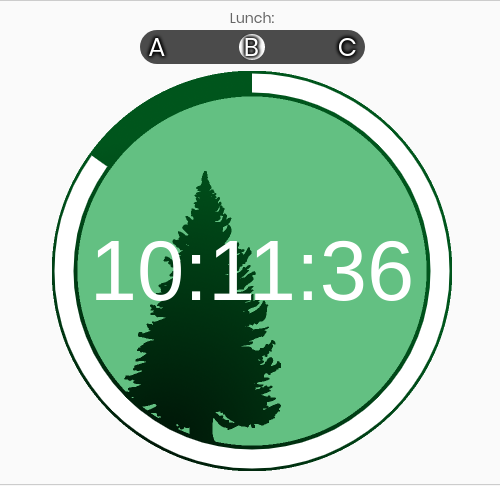
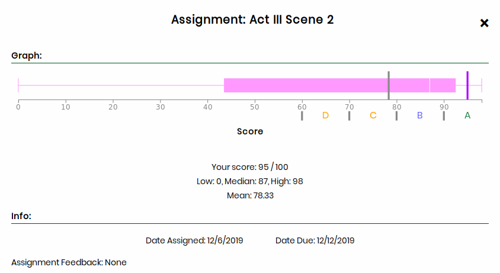
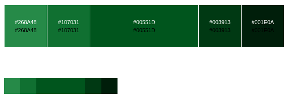

# Aspine

Who needs Aspen when you have Aspine. It serves as a one stop shop for everything Aspen related, and there are rainbows!

## Getting Started

Using Aspine is as easy as 1, 2, 3. Just visit aspine.cpsd.us and login with your Aspen credentials.

## Features

* Aesthetic Grade Checking
* CRLS Clock



* Grade Comparison via boxplot



* Calendar


* Chat with your classmates (coming soon...)

## FAQ

##### How are usernames and passwords handled?

Short answer: Aspine does not store any usernames or passwords.

Long answer: Aspine works by simulating a login on Aspen and formatting the data received. In doing this, it must transmit your username and password to the Aspen server. However, your login information is transmitted completely over encrypted connections (HTTPS), and it is not retained by Aspine at all. This can be verified by anyone who can read code, as all of our code is out in the open on this repository. If you are particularly paranoid, you can run Aspine locally on your computer instead of using the <https://aspine.cpsd.us> instance; instructions are below in the section "Contributing / Locally Running Aspine".

##### How are calculated grades computed?

First, calculated category percentages are computed by dividing a student's total earned points within a category by the total available points for that category. Then, the category percentages are multiplied by their respective weights and summed in order to produce the calculated grade for a class.

Note:
* Assignments scored with free text (i.e. "Missing", "Exempt") are ignored during grade computation. (Improvements coming soon)
* Due to the mysterious workings of Aspen, it is impossible to achieve 100% accuracy when making grade prediction calculations. That being said, Aspine's cutting edge grade calcuation algorithm is unmatched.


## Built With
* [Tabulator](https://github.com/olifolkerd/tabulator)
* [Plotly](https://plot.ly/javascript/)
* [CRLS Clock](https://github.com/CRLSCSClub/CRLSTime)
* [Full Calendar](https://fullcalendar.io/)

## Contributing / Locally Running Aspine

Feel free to suggest an enhancement or post a bug issue either via github issues or this [google form](https://goo.gl/forms/PYQDtzkp0vHJbFLz2)!

If you would like to directly contribute to Aspine, you can fork this repository and clone your fork on your computer with a [git](https://git-scm.com/) client.

If you would just like to try out Aspine on your computer, you can click on "Clone or download" above the file list and download and extract a ZIP file with Aspine.

<!--
If you use Windows, you can just right-click on the file "install1.bat" and click "Run as administrator" to begin the process. If you have already done this, double-click on the file "npminstall.bat". The ".bat" file extension may be invisible depending on your system configuration.
* Make sure that you have installed [node.js](https://nodejs.org/), npm, and [redis](https://redis.io/).
  * On GNU+Linux, you should be able to find both of these in your package manager (e.g. `apt`/`dpkg`, `yum`/`dnf`, `zypper`, `pacman`). npm may be in a separate package from node.js.
  * On macOS, node.js (including npm) and redis are available on [Homebrew](https://brew.sh/), as [`node`](https://formulae.brew.sh/formula/node) and [`redis`](https://formulae.brew.sh/formula/redis) respectively. You can run the script `install.sh` to install these dependencies.
  * Open a new terminal or command prompt, navigate to the directory in which you cloned the Aspine git repository, and run `npm install` to install the remaining dependencies.
* Open another terminal or command prompt, navigate to that same directory, and run `redis-server redis.conf`.
* In the other terminal or command prompt, run `node ./serve.js insecure`, or `node ./serve.js insecure fake` to use the `sample.json` file instead of pulling from Aspen (for faster testing).
-->

* Make sure that you have installed [node.js](https://nodejs.org/), including npm.
  * On Linux-based operating systems, you should be able to find node.js in your package manager (e.g. `apt`/`dpkg`, `yum`/`dnf`, `zypper`, `pacman`, or a GUI such as Ubuntu Software Center or GNOME Software); npm may be in a separate package.
  * On macOS, node.js (including npm) is available on [Homebrew](https://brew.sh/) as [`node`](https://formulae.brew.sh/formula/node). To install Homebrew and node, you can run the script `install.sh` by opening a terminal, using `cd` to navigate to the directory where you cloned or downloaded Aspine, then typing `./install.sh`.
  * On Windows, the node.js installer can be downloaded from [the website](https://nodejs.org/). Run the installer and follow the on-screen instructions.
* Install additional dependencies through node.js (this must be done each time you clone or download Aspine). If you used the macOS install script, you can skip this step.
  * On Unix-like operating systems (includes Linux-based and macOS), open a terminal, use `cd` to navigate to the directory where you cloned or downloaded Aspine, and run `npm install`.
  * On Windows, double-click on the script `npminstall.bat`. The `.bat` file extension may be invisible depending on your system configuration.
* Run the Aspine server.
  * On Unix-like operating systems, run `node ./serve.js insecure` or `./start.sh` in a terminal from the directory where you cloned or downloaded Aspine.
  * On Windows, double-click on the script `start.bat`. The `.bat` file extension may be invisible depending on your system configuration.

## Authors

* [**Max Katz-Christy**](https://github.com/maxtkc)
* [**Cole Killian**](https://github.com/ruborcalor)
* [**psvenk**](https://github.com/psvenk)


## [Color Scheme](http://paletton.com/#uid=12W0u0kw0e-n8nFrjj8Hz9QS55d)



```
Primary Color: #00551D
Secondary Colors:
 - #268A48
 - #107031
 - #003913
 - #001E0A
```

#### Grade Lettering and Coloring

| Grade Range   | Letter        | Primary Color | Secondary Color |
| :-----------  |:--------------|:------        |:------          |
| 96.5 - 100    | A+            |#1E8541        |#3d995c          |
| 92.5 - 96.4   | A             |#1E8541        |#3d995c          |
| 89.5 - 92.4   | A-            |#1E8541        |#3d995c          |
| 86.5 - 89.4   | B+            |#6666FF        |#a3a3f5          |
| 82.5 - 86.4   | B             |#6666FF        |#a3a3f5          |
| 79.5 - 82.4   | B-            |#6666FF        |#a3a3f5          |
| 76.5 - 79.4   | C+            |#ff9900        |#eba947          |
| 72.5 - 76.4   | C             |#ff9900        |#eba947          |
| 69.5 - 72.4   | C-            |#ff9900        |#eba947          |
| 66.5 - 69.4   | D+            |Orange         |#ebb147          |
| 62.5 - 66.4   | D             |Orange         |#ebb147          |
| 59.5 - 62.4   | D-            |Orange         |#ebb147          |
| 0    - 59.4   | F             |Red            |#eb4747          |


## License

Copyright [Aspine contributors](https://github.com/Aspine/aspine/graphs/contributors) 2020.

This project is licensed under the GNU General Public License, version 3 - see the [LICENSE.md](LICENSE.md) file for details.
