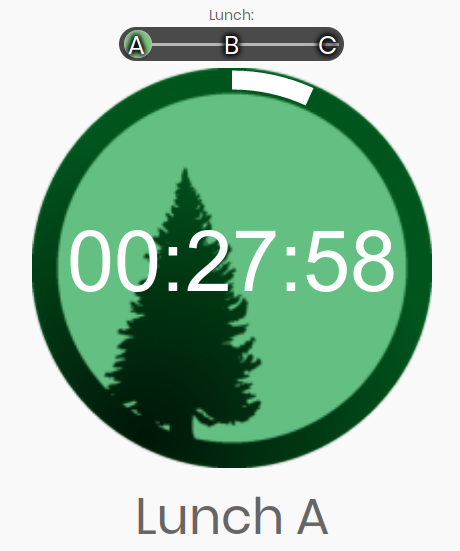
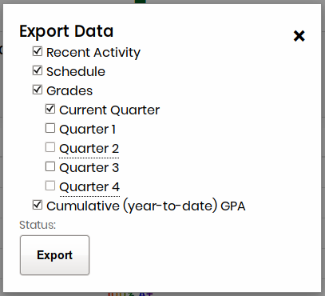
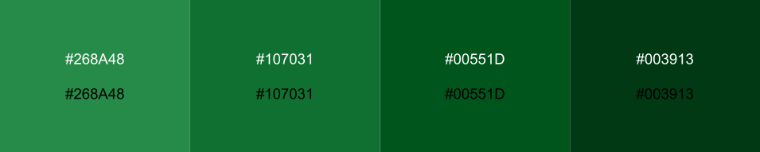
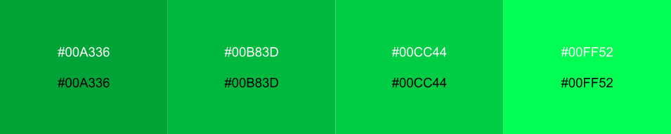

# Aspine

Who needs Aspen when you have Aspine? It serves as a one stop shop for
everything Aspen related, and there are rainbows!

## Getting Started

Using Aspine is as easy as 1-2-3. Just visit <https://aspine.cpsd.us> and log 
in with your Aspen credentials.

If you have an iPhone and would prefer to use an app instead of the website, 
Aspine is [on the iOS App Store](https://apps.apple.com/us/app/aspine/id1498713667).

## Features

* Aesthetic Grade Checking

* CRLS Clock



* Grade Comparison via Box Plot


* Export and Import your Grades



## FAQ

### How are usernames and passwords handled?

Short answer: Aspine does not store any usernames, passwords, or student data.
Moreover, <https://aspine.cpsd.us> is hosted on CPSD servers, so your data are
safe in any case.

Long answer: Aspine works by simulating a login on Aspen and formatting the
data received. In doing this, it must transmit your username and password to
the Aspen server. However, your login information is transmitted completely
over encrypted connections (HTTPS), and it is not retained by Aspine at all.
This can be verified by anyone who can read code, as all of our code is out in
the open on this repository. If you are particularly paranoid, you can run
Aspine locally on your computer instead of using the <https://aspine.cpsd.us>
instance; instructions are below in the section "Contributing / Locally Running
Aspine".

### How are calculated grades computed?

First, calculated category percentages are computed by dividing a student's
total earned points within a category by the total available points for that
category. Then, the category percentages are multiplied by their respective
weights and summed in order to produce the calculated grade for a class.

Note:
* Assignments scored with free text (i.e. "Missing", "Exempt") are ignored
  during grade computation. (Improvements coming soon)
* Due to the mysterious workings of Aspen, it is impossible to achieve 100%
  accuracy when making grade prediction calculations. That being said, Aspine's
  cutting edge grade calcuation algorithm is unmatched.

## Aspine Lite

If you have a grade export (as a JSON file) and want to view it using Aspine,
you may run into the problem that the current version of Aspine is too new to
view your JSON file (or you just want to view your grades offline). We have
created a variant of Aspine called "Aspine Lite" which contains the complete
Aspine user interface but without connecting to Aspine or Aspen servers over the
Internet.

Downloads for Aspine Lite can be found under "Assets" on [the Releases page on
GitHub](https://github.com/Aspine/aspine/releases). To use Aspine Lite, simply
download the zip file, extract it to a folder, and open `home.html` in a Web
browser.

## Contributing / Locally Running Aspine

Feel free to suggest an enhancement or report a bug either via GitHub
issues or this [form](https://goo.gl/forms/PYQDtzkp0vHJbFLz2)!

If you would like to directly contribute to Aspine, you can fork this
repository and clone your fork on your computer with a
[git](https://git-scm.com/) client. Please use the `master` branch as the base
of your changes.

If you would just like to try out Aspine on your computer, you can click on the
green "Code" button above the file list and download and extract a ZIP file
with Aspine.

- Make sure that you have installed [node.js](https://nodejs.org/), including
npm.

  + On Linux-based operating systems, you should be able to find node.js in
your package manager (e.g. `apt`/`dpkg`, `yum`/`dnf`, `zypper`, `pacman`,
or a GUI such as Ubuntu Software Center or GNOME Software); npm may be in a
separate package.

  + On macOS, node.js (including npm) is available on
[Homebrew](https://brew.sh/) as
[`node`](https://formulae.brew.sh/formula/node). To install Homebrew and node,
you can run the script `install.sh` by opening a terminal, using `cd` to
navigate to the directory where you cloned or downloaded Aspine, then typing
`./install.sh`.

  + On Windows, the node.js installer can be downloaded from
[the website](https://nodejs.org/). Run the installer and follow the on-screen
instructions.

- Install additional dependencies through node.js (this must be done each time
you clone or download Aspine). If you used the macOS install script, you can
skip this step.

  + On Unix-like operating systems (includes Linux-based and macOS), open a
terminal, use `cd` to navigate to the directory where you cloned or
downloaded Aspine, and run `npm install`.

  + On Windows, double-click on the script `npminstall.bat`. The `.bat` file
extension may be invisible depending on your system configuration.

- Start the Aspine server by running `npm start` in a terminal window (or
  Command Prompt on Windows). If you are on a Unix-like system, you can run
  `npm start &` to run the server in the background and then run
  `killall node` when you want to kill the server.

## Authors

- [**Max Katz-Christy**](https://github.com/maxtkc)
- [**Cole Killian**](https://github.com/Ruborcalor)
- [**psvenk**](https://github.com/psvenk)
- [**Ken Kalin**](https://github.com/kdk1616)
- [**notrodes**](https://github.com/notrodes)


## [Color Scheme](http://paletton.com/#uid=12W0u0kw0e-n8nFrjj8Hz9QS55d)

#### Light Mode

```
Primary Color: #00551D
Secondary Colors:
 - #268A48
 - #107031
 - #003913
```

#### Dark Mode

```
Primary Color: #00CC44
Secondary Colors:
 - #00A336
 - #00B83D
 - #00FF52
```

#### Grade Lettering and Coloring

| Grade Range   | Letter        | Primary Color | Secondary Color |
| :-----------  |:--------------|:--------------|:----------------|
| 96.5 - 100    | A+            |#1E8541        |#3d995c          |
| 92.5 - 96.4   | A             |#1E8541        |#3d995c          |
| 89.5 - 92.4   | A-            |#1E8541        |#3d995c          |
| 86.5 - 89.4   | B+            |#6666FF        |#a3a3f5          |
| 82.5 - 86.4   | B             |#6666FF        |#a3a3f5          |
| 79.5 - 82.4   | B-            |#6666FF        |#a3a3f5          |
| 76.5 - 79.4   | C+            |#ff9900        |#eba947          |
| 72.5 - 76.4   | C             |#ff9900        |#eba947          |
| 69.5 - 72.4   | C-            |#ff9900        |#eba947          |
| 66.5 - 69.4   | D+            |Orange         |#ebb147          |
| 62.5 - 66.4   | D             |Orange         |#ebb147          |
| 59.5 - 62.4   | D-            |Orange         |#ebb147          |
| 0    - 59.4   | F             |Red            |#eb4747          |


## Privacy

Our privacy policy can be viewed at <https://www.cpsd.us/privacy>.

## License

Copyright
[Aspine contributors](https://github.com/Aspine/aspine/graphs/contributors)
2019-21.

This software is licensed under the GNU General Public License, version 3
&mdash; see the [LICENSE.md](LICENSE.md) file for details.

If you contribute to Aspine, please note that you are consenting to having your
contributions released under the terms of this license. For any contributions
dated on or after October 23, 2020, you also consent to having your
contributions be released under any earlier or later version of the GNU General
Public License, as published by the Free Software Foundation, if and when the
licensing terms for Aspine are changed to allow such version(s). (For more
information about the rationale behind this clause, please read issue
[#38](https://github.com/Aspine/aspine/issues/38).)
